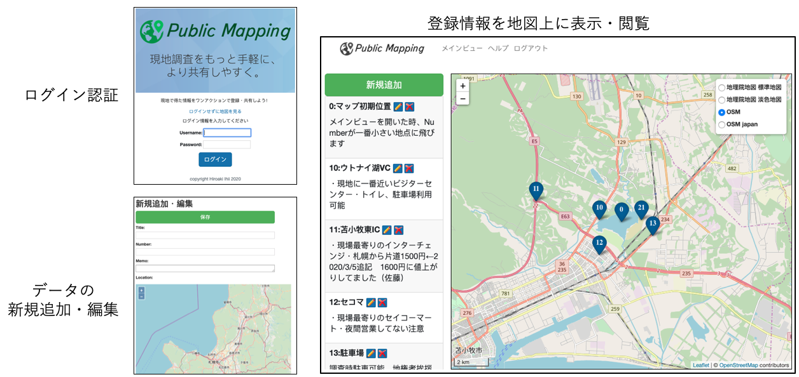
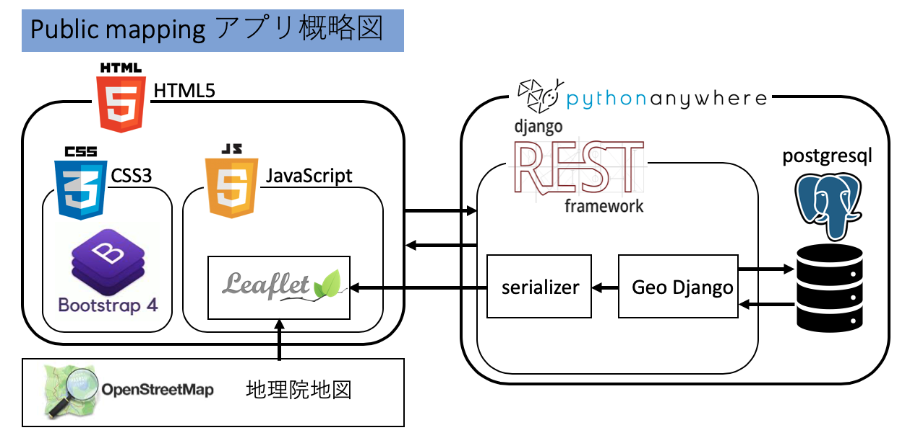

# Public Mapping - 現地調査をもっと手軽に、より共有しやすく -

## アプリのコンセプト
「属人化しがちな現地情報を、このアプリを介して簡単・安全に、ワンアクションで記録・共有することで、
情報共有不足によるヒューマンエラーを現場から一掃します！」 

## 主な機能
- ログイン認証
- 位置情報（緯度・経度）に紐づいた文字情報（タイトル、番号、メモ）の登録
- インタラクティブな地図ウィジェットによる簡単なデータ記録
- 登録した情報の閲覧
- 登録番号による情報のソート（自動・昇順）
 

### アプリ概略 2020年2月29日にリリースできました。

### 開発記録は以下のページにまとめました
[自作アプリPublic mappingの開発記録](https://qiita.com/hiro-ishi/items/823a4301272348f835cb)

## デモ
[Public mapping](http://hiroshi55.pythonanywhere.com/) 

## コアコンピタンス
### google map マイマップとの違い
・外部への共有機能が排除してあるため、ユーザ名・ログインパスワードを知らない他者へのうっかり情報漏洩の心配がありません。（現在はプロトタイプ版なのでログインせずに情報が見れるようになっています） 
・クラウドサーバーでなく、特定のサーバーを利用できるため、情報セキュリティ上管理しやすくなっています。 
・背景地図をOSM(Open Street Map)か地理院地図かから選択ができるため、商用利用でも費用が発生しません。 
・アイコンに番号を振れるため、どの地点が何のデータかひと目でわかります 

### Public Mappingのコンセプトの詳細、開発しようと思い至った経緯は以下のぺージにまとめました
[自作アプリPublic mappingのコンセプトと作るに至った経緯](https://qiita.com/hiro-ishi/items/24cd71129cad3d64edd5)

# 詳細情報
## 動作環境
Google Chrome (Version 80.0)
パソコン、スマホアプリ共に動作確認

## Requirement
Python 3.7.4 
Django 3.0.2 
Django Rest Framework 3.11.0 
 
Geo Django Dependencies 
- PostgreSQL 11.5 
- postgis 2.5.3 
- gdal 2.4.2 
- libgeoip 1.6.12 
 
[Bootstrap V4.4.1 CDN(Content Delivery Network)](https://www.bootstrapcdn.com) 
[Leaflet 1.6.0 Hosted version](https://leafletjs.com/download.html) 
[OpenStreetMap](https://www.openstreetmap.org/copyright) 

### ローカル開発環境
Docker container:[kartoza/postgis](https://hub.docker.com/r/kartoza/postgis/tags) 

### 本番環境（デプロイ先）
[Pythonanywhere.com](https://www.pythonanywhere.com/)

## Author & Acknowledgment
### Author
**Hiroaki Ishii** 
Twitter: [@hiroishi0422](https://twitter.com/hiroishi0422) 
Qiita: [@hiro-ishi](https://qiita.com/hiro-ishi) 

### Acknowledgment
**Yuu Takahashi** 
Supervise, schedule management, Direction, and debug 
Twitter: [@john95206](https://twitter.com/john95206) 
Qiita: [@john95206](https://qiita.com/john95206) 

**Yusuke Sugamiya** 
Code review, debug, and advice 
Website: [dnpp.org](https://dnpp.org) 

**Katopan** 
Debug, and advise 
Twitter: [@katopan_da](https://twitter.com/katopan_da) 

**Hiroshi Omata** 
Code review and advice 
Twitter: [@homata](https://twitter.com/homata) 

**Mami Enomoto** 
Code review and advice 
Twitter: [@mamix1116](https://twitter.com/mamix1116) 

# 開発に関する詳細情報
## ユーザー登録・ログイン認証について
・ユーザーは管理者がアカウント、パスワードを作成して付与することを想定し、サインアップ機能は実装していない。 
・Userモデルが持つ既存の12のフィールド（以下）に変更は加えていない 
username, first_name, last_name, email, password, groups, user_permissions, is_staff, is_active, is_superuser, last_login, date_joined

## modelの定義
models.pyのPostクラスに定義されたフィールドは以下の通り 
GeoDjangoのgeometric fieldの一つであるPointFieldを用いて、緯度経度情報を持った位置情報のメモをPost modelとして作成した。 

Fields | Detail
------------ | -------------
title | 地点名称（13文字以内の全角・半角文字情報）
number | 地点番号（0~999の整数値）
location | 緯度経度情報(世界測地系WGS84(srid = 4326)に基づく緯度経度、小数値)
memo | 記録したい情報（100文字以内の全角・半角文字情報）

## viewsの設定
### CRUDの実装
views.pyで新規追加(post_add)、編集(post_edit)、削除(post_delete)を定義し、CRUDを実装 

### GeoJSONの生成
APIViewクラスを用いて、全てのPostオブジェクト含むGeojsonを生成するGeojsonAPIView(APIView)クラスを作成し、ルーティングで'mapping/geojson/'というURLを割り当てた。 

## Formの作成
ModelFormを用いてPost modelを取り込み、'title','number','memo', 'location'のフィールドのフォームを作成。 
locationフィールドはOSMWidgetを使用し、インタラクティブな入力画面を設定。 

## ライセンス・素材引用元
LOGO作成: [LOGSTER](https://www.777logos.com) 
icons: [All-free-download.com](https://all-free-download.com/free-icon/download/24x24-free-application-icons-icons-pack_120732.html) 
トップページ、ログインページ背景画像: [ドットインストール](https://dotinstall.com/lessons/basic_twitter_bootstrap_v5)

## 参考資料
README.mdの書き方について以下を参照した 
[わかりやすいREADME.mdを書く](https://deeeet.com/writing/2014/07/31/readme/)  
Djangoでのアプリ開発については以下のチュートリアルで学習した。 
[Django Girls Tutrial](https://tutorial.djangogirls.org/en/) 
Geo Django dependenciesのインストールについては以下のページを参照した。 
[Make a Location-Based Web App With Django and GeoDjango](https://realpython.com/location-based-app-with-geodjango-tutorial/) 
[GeoDjangoで始める地理空間情報](https://homata.gitbook.io/geodjango/geodjango/tutorial) 
ログイン・ログアウトページで以下のページのコードを引用した。 
[Github toksan/django2_tutorial_blog_with_auth](https://github.com/toksan/django2_tutorial_blog_with_auth/tree/master/myblog/templates/registration) 
USERモデルのカスタマイズは以下のページを参照した。 
[Django ログイン認証](https://noumenon-th.net/programming/2019/11/25/django-abstractuser/)  
DjangoでのCRUD操作実装は以下のページを参照・一部コードの引用をした。 
[DjangoでCRUD](https://qiita.com/zaburo/items/ab7f0eeeaec0e60d6b92) 
OSMWidgetを使った入力画面の設定は以下のページを参照した。 
[OSMWidget - map doesn't show in template - ReferenceError: ol is not defined](https://stackoverflow.com/questions/47750850/osmwidget-map-doesnt-show-in-template-referenceerror-ol-is-not-defined) 
Leaflet Awesome Markers Pluginの改修に際して、以下のページから一部コードを引用した。 
[Leaflet Awesome-Markers (Adding Numbers)](https://stackoverflow.com/questions/22622393/leaflet-awesome-markers-adding-numbers)
